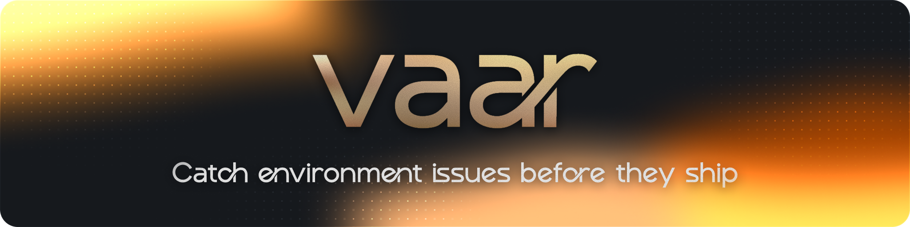

<!-- Copyright © 2026 envaar
SPDX-License-Identifier: Apache-2.0 -->



[](https://github.com/envaar/vaar/releases/latest)
[](./go.mod)
[](https://vaar.envaar.dev/docs)

# Vaar

Vaar is an intelligent linter for environment correctness.

It catches broken `.env` files, misconfiguratons in environments and helps you work with your secrets safely both during development as well as in production.

## Why Vaar?

Issues with `.env` files are usually missed or overlooked during code review due to them being difficult to share and compare thanks to their sensitive nature. Since environment variables are not as easily reviewable as code artifacts, it is all the more important to ensure their hygiene and quality.

Vaar encompasses linting and hygiene for various environment configurations, thus enforcing better environment management standards. A single execution discovers files, selects a customisable set of rules to enforce, reports findings and repairs any formatting drift that can be safely fixed.

## What makes Vaar different?

Most dotenv linters are limited to `.env` files while secret scanners look for leaked credentials. Generic code-quality tools are not centered on environment correctness. Additionally, runtime validators only run after application code starts.

The endeavour with Vaar has begun with deterministic `.env` hygiene, but is envisioned to grow into repo-aware, intelligent environment correctness tooling.

Vaar aims to :

- detect env vars used in source code and flag issues
- compare code usage against `.env.example`
- detect stale, missing, duplicated and undocumented variables
- understand Docker and Docker Compose env behavior and flag misconfigurations
- understand CI env references in GitHub Actions and flag anamolous configurations
- add framework-specific rules for Next.js, Vite, Prisma, Node, Docker and GitHub Actions
- emit machine-readable output for CI, review tools and future integrations

For more details about the planned scope and future direction of Vaar, read the [Roadmap](#roadmap).

## Installation

### Go install

```bash
go install github.com/envaar/vaar/cmd/vaar@latest
vaar --version
```

Source installs use the Go version declared in go.mod.

### GitHub Release binaries

Release binaries are published for Linux, macOS and Windows on `amd64` and `arm64`.

| Platform | Archives                                               |
| -------- | ------------------------------------------------------ |
| Linux    | `vaar_linux_amd64.tar.gz`, `vaar_linux_arm64.tar.gz`   |
| macOS    | `vaar_darwin_amd64.tar.gz`, `vaar_darwin_arm64.tar.gz` |
| Windows  | `vaar_windows_amd64.zip`, `vaar_windows_arm64.zip`     |

Download the matching archive and `vaar_checksums.txt`, then verify the archive, extract it and confirm the binary.

> [!NOTE]
> The release workflow mandatorily publishes `vaar_checksums.txt` with SHA256 checksums for every release archive.

For Unix-like systems:

```bash
archive=vaar_linux_amd64.tar.gz
curl -LO "https://github.com/envaar/vaar/releases/latest/download/$archive"
curl -LO https://github.com/envaar/vaar/releases/latest/download/vaar_checksums.txt
grep "$archive" vaar_checksums.txt | sha256sum -c -
tar -xzf "$archive"
./vaar --version
```

For macOS systems:

```bash
archive=vaar_linux_amd64.tar.gz
curl -LO "https://github.com/envaar/vaar/releases/latest/download/$archive"
curl -LO https://github.com/envaar/vaar/releases/latest/download/vaar_checksums.txt
grep "$archive" vaar_checksums.txt | shasum -a 256 -c -
tar -xzf "$archive"
./vaar --version
```

For Windows PowerShell:

```powershell
$archive = 'vaar_windows_amd64.zip'
Invoke-WebRequest -Uri "https://github.com/envaar/vaar/releases/latest/download/$archive" -OutFile $archive
Invoke-WebRequest -Uri "https://github.com/envaar/vaar/releases/latest/download/vaar_checksums.txt" -OutFile vaar_checksums.txt
$line = Select-String -Path .\vaar_checksums.txt -Pattern $archive
$expected = ($line.Line -split '\s+')[0].ToLower()
$actual = (Get-FileHash .\$archive -Algorithm SHA256).Hash.ToLower()
if ($actual -ne $expected) { throw "checksum mismatch" }
Expand-Archive .\$archive -DestinationPath .
.\vaar.exe --version
```

## Quick start

To test out the linter's capabilities, run Vaar from the repository you want to check:

```bash
vaar lint
```

Use the `--json` flag output for a portable export in the form of a JSON:

```bash
vaar lint --json
```

To write that JSON report to a file instead of `stdout`, use:

```bash
vaar lint --json --output=report.json
```

This writes the JSON report to a file. For the full file-output behavior, see [docs/lint/README.md](./docs/lint/README.md).

To apply safe, non destructive formatting fixes, use:

```bash
vaar lint --fix
```

To lint only using specific rules:

```bash
vaar lint --only=duplicate-key --only=invalid-key-name
```

To lint while skipping specific rules:

```bash
vaar lint --skip=trailing-whitespace
```

To lint one explicit dotenv file or one directory tree:

```bash
vaar lint --target=.env.staging
vaar lint --target-dir=src
```

To list every registered rule with its description:

```bash
vaar lint --list-rules
```

For the lint-specific command reference and rule catalog, see [docs/lint/README.md](./docs/lint/README.md).

### Examples

To try out `vaar lint` quickly, you can use some of the examples given below:

- [Basic example](./examples/basic/README.md)
- [Broken example](./examples/broken/README.md)

To use these, simply create a new `.env` file at your repository and copy paste the values from the respective `.env.example`.

## Example Output

```text
warn space-character .env:2 line has spaces around the key, delimiter or value
warn trailing-whitespace .env:2 line has trailing whitespace
error duplicate-key .env:4 APP_ENV is defined more than once
error incorrect-delimiter .env:5 DATABASE_URL uses ':' instead of '='
error invalid-key-name .env:6 api-key is not a portable env key name
warn ending-blank-line .env:8 file must end with exactly one final newline
warn extra-blank-line .env:8 repeated blank line
exit status 1
```

## Implemented Rules

To see the complete list of implemented rules, see [docs/lint/rules](./docs/lint/rules/README.md) for the full rule reference.

## Usage

For details about the supported commands (and their flags), supported behaviour and so on, please read [Usage](/docs/usage.md).

For specific details about the lint functionality command, please see [Lint Usage Guide](/docs/lint/README.md) for more information about Output and Exit Codes, Rule Selection etc.

## Roadmap

Vaar's intends to become the one stop solution for all things related to environment variables.

For now, this includes all possible linting rules that can help prevent issues related to environments in codebases broadly divided into the given [Evidence-Based Categories](/docs/lint/rules/README.md).

### Deterministic

These findings are deterministic in nature.

- Already implemented: deterministic `.env` hygiene, stable text and JSON reporting and safe normalization fixes.
- Straightforward next steps: a few more line-level hygiene rules and small parser or reporter refinements.
- Examples: duplicate keys, trailing whitespace, a missing final newline, mixed line endings or a UTF-8 BOM.

### Contextual

These findings are based on project and it requires codebase context.

- Straightforward next steps: compare `.env` with `.env.example`, scan source and config files for env usage and look for drift in Docker Compose or GitHub Actions.
- Requires more design: smarter inventory checks, framework-aware rules and better drift detection.
- Examples: a variable used in code but missing from the example file, stale keys that no longer appear in the repo or undocumented env names.

### Heuristic

These findings are based on general practices and heuristic patterns which are suspicious or potentially dangerous.

- Requires more design: suspicious public env names or secret-like values that should be reviewed by a human should be flagged by Vaar as warnings.
- Examples: a token-shaped string in a public example file or a naming pattern that looks risky but still needs review.

### External

These findings are dependent on external APIs or third-party tools for verification

- Out of scope for now: cloud or provider drift, external scanners, team sync, access-control checks and audit integrations.
- Examples: confirming exposure through a third-party service or checking provider state through an API.

> [!NOTE]
> These goals are not set in stone and are subject to change. If you wish to request a goal to be modified, added/removed or some new direction/scope that the team should explore, please reach out by sending a mail to [core@envaar.dev](mailto:core@envaar.dev) or open a [Discussion](https://github.com/envaar/vaar/discussions).

## Non-goals

Vaar is intentionally focused on environment and configurational correctness across complex use cases. It is not trying to be:

- simple environment syncing across teams without detailed features such as repository context, code usage or drift analysis.
- a tool that treats `.env` files as the only source of truth instead of comparing them with example files, source code and config state.
- runtime-only validation that waits for the application to start instead of analyzing the repo first.
- a generic configuration platform for arbitrary file formats rather than environment-variable correctness.
- a secret manager or vault replacement.
- a guessy scanner that reports weak patterns without clear evidence or reviewable context.
- a deployment or infrastructure orchestration tool that goes overreaches beyond environment correctness.

Those boundaries are intentional. Vaar should stay focused before it grows broader.

> [!NOTE]
> These non-goals are not set in stone and are subject to change. If you wish to request to add or reconsider (remove) a non-goal or some new direction/scope that the team should explore, please reach out by sending a mail to [core@envaar.dev](mailto:core@envaar.dev) or open a [Discussion](https://github.com/envaar/vaar/discussions).

## Project Support

| Area                   | Current Support as of Latest Release  |
| ---------------------- | ------------------------------------- |
| Operating systems      | Linux, macOS, Windows                 |
| Architectures          | `amd64`, `arm64`                      |
| Shell completions      | Bash, Zsh, Fish, PowerShell           |
| Official install paths | `go install`, GitHub Release binaries |
| Go toolchain           | Go version declared in go.mod         |

> [!NOTE]
> The scope of "Supported" means that the project expects installation, checksum verification and described vaar functionality to work for the above configurations. To request a new configuration, please create a new [Issue](https://github.com/envaar/vaar/issues)

## Documentation

Please refer to [/docs](/docs/) for all necessary documentation. If you are unsure where to start, try reading [Usage](/docs/usage.md). New developers can read the [Primer](/docs/primer/README.md) for a fast, hands-on tour of how Vaar works.

## System Overview and Repository Layout

Please read [System Overview](./docs/system-overview.md) to learn about the Repository Layout, Design Principles and other useful information.

## Development

Please read [Development Workflow](./CONTRIBUTING.md) to understand the typical development steps for Vaar.

## FAQ / Troubleshooting

- If nothing was flagged, Vaar scanned the current working tree and did not find anything to report. Confirm you are in the repository/root you meant to scan.
- To verify a downloaded binary, compare it against `vaar_checksums.txt` and then run `vaar --version` after extraction.
- Exit codes are intentionally simple: `0` means no findings remain after an optional `--fix` pass, `1` means findings remain and `2` means the command failed before producing results.

## Contributing

Please read [CONTRIBUTING.md](./CONTRIBUTING.md) before opening a pull request.

## Security

Please read [SECURITY.md](./SECURITY.md) before reporting a vulnerability or a redaction concern.

## License

Vaar is licensed under the Apache License 2.0. See [LICENSE](./LICENSE).

## Contact

To contact the maintainers of this project, please reach out by sending a mail to [core@envaar.dev](mailto:core@envaar.dev).
